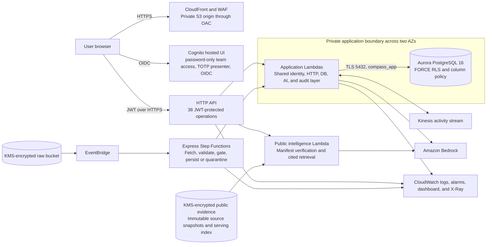
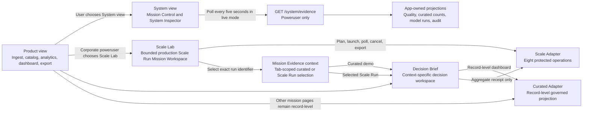
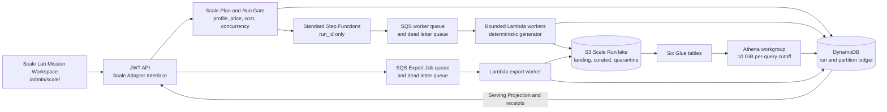

# Compass architecture

This document describes the current demonstration candidate. Claims are tied
to `template.yaml`, `db/migrations/`, `src/`, `frontend/`, and the two GitHub
Actions workflows.

## 1. System context

Compass is one AWS SAM stack in `us-east-1` plus a statically exported Next.js
application. The web application is public at the CloudFront edge, but every
application API route requires a Cognito token. Relational portfolio functions
and Aurora are in private subnets. The public-intelligence function is isolated
from that database path and reads only its dedicated KMS-encrypted S3 prefix.

## 2. Deployable inventory

The template provisions:

- A VPC with two public and two private subnets across two availability zones
- One NAT gateway for the cost-controlled demonstration mode
- A customer-managed KMS key with rotation enabled
- An Aurora Serverless v2 PostgreSQL 16.9 cluster and managed master secret
- Cognito with password-only team accounts, a dedicated TOTP presenter,
  admin-created users, and poweruser and viewer groups
- An HTTP API with the JWT authorizer as its default
- Sixteen core Lambda functions and one shared Lambda layer
- A KMS-encrypted raw S3 bucket with EventBridge notifications
- An on-demand Kinesis stream
- An Express Step Functions intake workflow
- A private S3 web bucket, CloudFront OAC, path rewrite function, and WAF
- Explicit 14-day API and centralized Lambda log groups
- Four service alarms and one CloudWatch operations dashboard
- Optional account-level GuardDuty, Security Hub, and Macie resources

When `ScaleFeatureEnabled=true`, the same template adds three Lambda functions,
one Standard Step Functions workflow, one DynamoDB run and partition ledger,
one encrypted Scale Run S3 lake, worker and Export Job SQS queues with dead
letter queues, six Glue tables, one bounded Athena workgroup, scale-specific
alarms, and scale dashboard widgets. The enabled stack therefore has nineteen
functions. These resources are conditional and their presence in source does
not establish that a live deployment or measured Scale Run exists.

The sixteen core functions are authorizer, intake, quality gate, catalog,
analytics, dashboard, summarize, RAG chat, approvals, license, export, evidence,
RMF artifact, migrator, document ML, and public intelligence. The three scale
functions are scale control, scale worker, and scale export.

## 3. Record life cycle

1. A sanitized JSON drop lands under the raw bucket ingest prefix.
2. S3 emits an object-created event through EventBridge.
3. The Express workflow runs Fetch, FetchGate, Validate, QualityGate, and one
   of Persist or Quarantine.
4. The intake adapter detects canonical or compatible legacy fields and writes
   raw records.
5. Deterministic rules score required fields, types, ranges, and duplicates.
6. A passing batch writes curated records and run-specific lineage. A failing
   batch remains quarantined and writes no curated rows.
7. Analytics reads governed records, persists topics and model-run evidence,
   and emits downstream lineage.
8. The dashboard and RAG service query inside the caller's row-policy context.
9. Export rechecks row and column policy, evaluates the aggregation guard,
   atomically consumes any required approval, appends audit evidence, and
   delivers the selected format.

The activity ticker is projection-first. Its authoritative ordering comes from
the governed database projection. The service merges recent Kinesis transport
receipts by stable event identifier when present. A receipt with no
organization scope is corporate-only, so missing transport metadata cannot
widen a scoped viewer's feed.

Workers exchange batch and run manifests. They do not pass the complete
record set through Step Functions state.

## 4. Identity and data authorization

API Gateway validates the Cognito token first. The shared identity module then
normalizes native JWT and request-authorizer event shapes. Cognito groups are
authoritative:

| Group | Application role | Database organization context |
|---|---|---|
| `compass-poweruser` | `poweruser` | `ONR-Corporate` |
| `compass-viewer` | `viewer` | `Code-30` |

A token with no recognized Compass group is denied. A forwarded role cannot
override the verified group mapping, and a supplied organization that
conflicts with the resolved role is denied. The resolved organization is bound
with `SET LOCAL` inside each database transaction. The runtime assumes
`compass_app`, which is not the table owner.

Forward migrations 003 and 004 provide five database safeguards:

1. Explicit runtime grants replace broad grants on every table.
2. The base curated relation omits funding-column permission.
3. The corporate view requires the `ONR-Corporate` transaction GUC.
4. Runtime audit access is insert and read only, and a trigger rejects update
   or delete even for an accidental elevated write path.
5. Migration 004 adds the verifier column with a narrow update grant, so an
   approval stores a SHA-256 verifier for its opaque capability, not the raw
   capability returned to the reviewer.

## 5. API and CORS boundary

The 38 method-and-path operations across 35 URL paths are listed in
`docs/CONTRACTS.md`. The default JWT authorizer protects every operation,
including the eight conditional Scale Run operations, OpenAPI document, and
System Inspector. Scale Run operations apply an additional corporate
poweruser policy.

API Gateway CORS and Lambda response CORS share the configured web origin. The
backend reflects only a normalized origin in `CORS_ALLOW_ORIGINS`; local
development is explicitly listed. No wildcard origin is returned.

## 6. Evidence architecture

The mission UI separates product decisions from system proof and scale proof.

The public evidence plane is also separate from the synthetic portfolio. Its
source collectors create minimized canonical records and immutable sidecar
manifests. The accepted S3 serving manifest binds a compact index by SHA-256.
`GET /public-intelligence/snapshot` verifies both objects before returning any
record, and `POST /public-intelligence/explain` retrieves only from that
verified index. Unsupported questions produce an explicit refusal. The full
source snapshots never pass through the browser.

The same isolated function exposes a cost-bounded public model execution
Adapter. It selects only from a digest-bound, PII-minimized validation pool,
loads the exact pending SageMaker package, and creates one network-isolated
Batch Transform job on one `ml.m5.large` instance. An S3 lock limits execution
to one active run. Versioned KMS-encrypted input, output, history pointers, and
terminal receipts preserve provenance across browser refreshes. The temporary
SageMaker Model is removed after reconciliation, and no endpoint or approval
change is allowed by the interface.

The System Inspector exposes only application-owned, allowlisted projections.
It includes deploy revision, generation time, correlation ID, request latency,
policy decision, recent runs, a stage trace derived from quality and curated
records, sanitized audit events, latest model-run metadata, and service
posture.

It excludes account IDs, ARNs, resource names, storage keys, database
endpoints, secrets, tokens, full claims, usernames, emails, IP addresses, SQL,
prompts, abstracts, raw records, presigned URLs, exceptions, and stack traces.

Live and replay adapters implement the same frontend contract. The mode badge
is part of the evidence, not decorative chrome. The Mission Evidence context
stores only a validated selection in the current browser tab. A Scale
selection changes Decision Brief to the exact aggregate Scale receipt and
prevents the curated dashboard request from mounting. It does not fabricate
row-level filters, funding charts, citations, or dispositions. Other mission
pages continue to use their curated adapters and show the selection as context
until they gain an explicit Scale-specific projection.

## 7. Responsive mission application

The Next.js 15 App Router application is exported as static assets. It provides
a public mission landing page, responsive authenticated shell, mobile drawer,
accessible skip navigation and focus states, role gates, reduced-motion
support, and a rehearsal-only Presenter Guide. The decision workspace adds
server-backed search and portfolio filters whose options and results remain
inside the caller's row-policy scope.

Primary routes follow the decision flow:

`/ingest/ -> /catalog/ -> /analytics/ -> /dashboard/ -> /export/`

Supporting routes are `/licenses/`, `/admin/pipeline/`, `/admin/scale/`, and
`/catalog/lineage/?batch=<id>`. The query-based lineage route works with
newly created batch IDs in a static export, so a post-build live ingest does
not require a new pre-rendered dynamic page.

## 8. Persistent deterministic replay

When `NEXT_PUBLIC_USE_MOCK=true`, state-changing portfolio adapters read one
versioned scenario store. State is persisted in the browser and distributed
to all subscribers. A fixed logical clock keeps screenshots and rehearsals
stable. Reference-only fixtures such as the license register remain static.

Important invariants are tested:

- Quality scores stay within valid bounds.
- Failed rows never become negative.
- A quarantined batch curates zero rows.
- A quarantined batch emits no curated, model, or dashboard lineage.
- Catalog, dashboard, stream, analytics, approvals, exports, and System
  Inspector derive from the same mutations.
- Export approval uses the same exact-fingerprint, expiry, separate-persona,
  and single-use behavior as the live contract.

Replay is deliberately labeled. It is a deterministic rehearsal adapter, not
an AWS execution emulator.

## 9. Delivery architecture

`.github/workflows/quality.yml` runs on pull requests and main-branch pushes.
It checks repository text policy, Python lint, production dependency audits,
offline tests, migration package synchronization, SAM validation and build,
frontend type safety, replay invariants, static build, and responsive browser
accessibility smoke tests.

`.github/workflows/deploy.yml` is manually dispatched against a protected
GitHub environment. It uses GitHub OIDC to assume an AWS role, stamps the short
source revision, and detects whether the stack already exists. For an existing
stack, it sends the additive source migrations to the deployed migrator before
switching application code. It derives the CloudFront origin and Cognito
callback values from stack outputs. A fresh stack uses an automatic two-phase
deployment so the generated domain is bound without operator-supplied web URL
variables. It then invokes the newly bundled migrator with
`{"migrate":"all"}`, builds the live frontend, publishes it, invalidates
CloudFront, and verifies the public UI and protected 401 boundary. Both
migration passes require an `ok` response and a `granted` runtime-role
bootstrap. The workflow also validates and passes the protected
export-threshold and database-resilience values, so the recorded policy is not
an implicit template default. It does not store long-lived AWS access keys in
the repository.

The recording baseline has a separate operator-only preparation path.
`scripts/prepare_demo.py` validates five fixed synthetic fixtures, verifies
three password-only team identities plus one TOTP formal presenter, stages
fixtures under non-triggering `.fixture` keys,
invokes the private migrator for a bounded transactional reseed, runs the
deployed Analytics Lambda under service actor `compass-demo-preparer`, and
emits a redacted readiness receipt. The reset refuses to run beside any
unexpected UI-driving state. Live Element 3 drops are one-shot, hash-bound
releases from fixed staged keys into the `drops/` trigger prefix. The protected
API relies on EventBridge as the single workflow starter. No caller can choose
a table, batch, user, license identity, or object key for this path.

## 10. Production Scale Run architecture

Scale Run is a separate Module with a narrow Interface and a production-shaped
AWS Implementation. Its Depth is in the deterministic workload, durable
receipts, idempotent state transitions, and cost controls behind that small
Interface. The HTTP and logical locator contracts are the Seam. The frontend
uses a Scale Adapter for the live service and a clearly labeled Rehearsal
Adapter for deterministic browser practice. Shared identity, HTTP, KMS, audit,
and SAM capabilities provide Leverage. Scale-specific control, worker, export,
and evidence code stays together to preserve Locality.

The Standard workflow passes only `run_id` between states. Durable state lives
in DynamoDB. It dispatches partition work, waits and checks completion, starts
six Athena conversions, waits and checks query state, finalizes the receipt
chain, and enters guarded failure or cooperative cancellation when required.
The Scale Worker runs outside the VPC because it needs only SQS, DynamoDB, S3,
KMS, and local scratch. Aurora remains the identity, approval, audit, and
Serving Projection boundary for the broader Compass product.

The fixed Workload Profiles represent total physical records across six linked
datasets:

| Profile | Records | Partition size | Exact partitions |
|---|---:|---:|---:|
| `1k` | 1,000 | 1,000 | 6 |
| `10k` | 10,000 | 5,000 | 6 |
| `100k` | 100,000 | 10,000 | 11 |
| `1m` | 1,000,000 | 25,000 | 41 |

Every profile uses grants 20%, finance 30%, milestones 20%, documents 10%,
licenses 2%, and stream events 18%. All child records link to a generated
grant. `synthetic_only=true`, the generator version, seed, and fixed as-of time
are sealed in the Run Manifest. The `1m` profile requires both a deployed
maximum of at least 1,000,000 records and a successful `100k` proof receipt
that remains in DynamoDB.

The Run Gate consumes an actor-bound Scale Plan once and enforces a 15-minute
expiry, launch idempotency, one active run by default, deployed concurrency,
the profile cost envelope, the deployment cost cap, and price freshness. The
official AWS Price List Query API snapshot has a server-calculated 30-day
maximum age with a bounded one-day clock-skew tolerance. Missing or stale
evidence fails closed, as does evidence dated more than one day in the future.
Profile cost envelopes are $0.10,
$0.25, $1.00, and $10.00 for `1k`, `10k`, `100k`, and `1m`, respectively. The
Cost Estimate includes a 25% contingency. Later evidence distinguishes
estimated, metered, and billed-reconciliation-pending amounts.

Each successful terminal path seals a Run Manifest plus Partition, Quality,
Intelligence, Performance, and Cost Receipts. Generated totals reconcile to
curated plus quarantined records unless a receipt explicitly records records
held at a batch boundary. Every data part and terminal receipt has a SHA-256
checksum. The Intelligence Receipt declares full-corpus or sampled coverage.
The Performance Receipt reports observed values, never modeled throughput as a
measurement. A completed asynchronous Export Job records exact rows, bytes,
Parquet format, checksum, expiry, and audit evidence.

Browser receipts expose logical `lake://scale-runs/...` and `run://...`
locators. They do not expose bucket names, object keys, ARNs, queue URLs, table
names, workflow execution IDs, or other physical infrastructure identifiers.
A ready Export Job may return a short-lived download action, but the physical
identifier is not rendered as receipt evidence.

The [production architecture](PRODUCTION_ARCHITECTURE.md) contains the full
invariants and lifecycle. The [cost model](COST_MODEL.md) compares the
pre-deployment demo and HA fixed monthly estimates and the incremental profile
estimates. These are architectural and planning claims, not evidence of a live
deployment or measured run.

## 11. Seven required elements

| Element | Running proof | Principal implementation |
|---|---|---|
| 1. Secure access | TOTP login, viewer and poweruser policy contrast, protected API | Cognito, API authorizer, shared identity, RLS and CLS migrations |
| 2. IaC and automation | Source template, CI gates, OIDC deploy, revision receipt, RMF artifact | `template.yaml`, `.github/workflows/`, migrator, RMF function |
| 3. Ingestion and streaming | Clean, legacy, and defective drops with curate or quarantine evidence | S3, EventBridge, Step Functions, intake, quality gate, Kinesis |
| 4. Governance and lineage | Catalog scores and run-emitted graph for the new batch | Catalog function and lineage relations |
| 5. Analytics | Governed NMF run with metrics, topics, trends, and recommendation | Analytics function and model relations |
| 6. Dashboard and automation | Scoped decision brief, RAG, anomaly approval, license register | Dashboard, RAG, approvals, and license functions |
| 7. Interoperability and export | HTTP 428, bound approval, one release, audit receipt, OpenAPI | Export, approvals, audit log, evidence route |

## 12. Open architecture and portability

The posture is portable data, standard contracts, and replaceable adapters.

| Layer | Current implementation | Portability seam |
|---|---|---|
| Data | Aurora PostgreSQL 16 plus pgvector | Plain versioned SQL can target another PostgreSQL 16 environment |
| Identity | Cognito | OIDC issuer, audience, and group mapping can point to an approved IdP |
| API | API Gateway HTTP API | Served OpenAPI 3.1 contract is independent of the gateway |
| Models | Bedrock | `compass_common/llm.py` isolates transport from callers |
| Ingestion | S3 and EventBridge | Source normalizers isolate schema variation from the pipeline |
| Workflow | Step Functions | Plain worker event contracts isolate the orchestration engine |
| Stream | Ordered database projection plus Kinesis transport receipts | Stable event identifiers and the intake API isolate transport from presentation |
| Web | S3 and CloudFront | Static output can be hosted on another approved web tier |
| Export | CSV, JSON, optional parquet | Standard non-proprietary delivery formats |

Managed AWS services are deliberate for the demonstration. Portability does
not mean that the current stack has no cloud dependencies.

## 13. Resilience modes and production target

`DatabaseResilienceMode=demo` is the default. It provisions one Aurora writer,
seven-day backup retention, and no deletion protection. The cluster can place
that writer in either configured subnet, but there is no second database
instance to take over. This mode must not be described as database failover.

`DatabaseResilienceMode=ha` adds one cluster reader, sets backup retention to
14 days, and enables deletion protection. Aurora can promote the reader if the
writer fails. This is a stronger demonstration posture, but it is still a
single-region architecture with one NAT gateway.

The cluster subnet group spans two availability zones, but the template does
not pin an availability zone on either instance. Verify actual instance
placement in the deployed stack before narrating an AZ-specific claim.

The production target is separate from both demo modes. Recovery time and
recovery point objectives must be approved from the mission impact analysis,
then validated by exercises. A production design would add approved
cross-region backup copy or replication, per-AZ egress, longer retention,
restore automation, DNS or traffic failover, SIEM integration, service
quotas, capacity tests, and recurring restore and failover drills. Compass
does not claim a production RTO, RPO, ATO, IL4 accreditation, or IL5
accreditation from this demonstration.

## 14. Additional honest boundaries

- The deployment is in commercial `us-east-1` with security-baseline
  equivalents. It is not a Government accredited enclave.
- Account-level GuardDuty, Security Hub, and Macie default off because they
  are singleton services that should be owned by the landing zone.
- The default one-NAT topology is a cost choice, not a production availability
  design.
- Parquet requires the optional pyarrow dependency. CSV and JSON are the
  default portable formats.
- The budget chart shows obligated award values against a computed even-spend
  baseline. No appropriation or authoritative budget-authority feed is
  ingested.
- License renewal urgency is computed in the browser from `renews_on`. No
  scheduled notification service is implemented.
