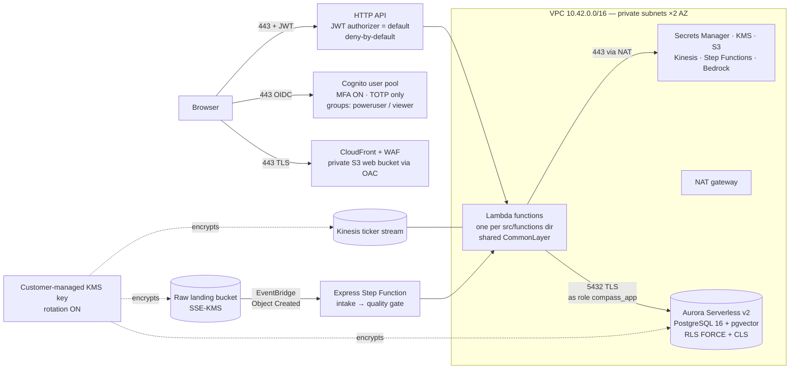

# Compass — Architecture

Companion to `docs/CONTRACTS.md` (the locked interface contracts). This
document explains **what the pieces are, how data flows through them, and
where the portability seams sit**. Every claim here is checkable against
`template.yaml`, `db/migrations/`, and `src/`.

## 1. System overview

One AWS SAM stack (`compass-demo`, us-east-1) plus a statically exported
Next.js front end. All data-touching compute runs in private subnets; the only
inbound paths are three TLS edges (CloudFront+WAF for the UI, the JWT-guarded
HTTP API, and the Cognito hosted UI).

Stack inventory (all in `template.yaml`, in this order): VPC (2 public +
2 private subnets, 1 NAT), customer-managed KMS key, Aurora Serverless v2
PostgreSQL (RDS-managed secret), Cognito (MFA ON, admin-create-only, two
groups), HTTP API with Cognito JWT authorizer as the **default** authorizer,
shared `CommonLayer` (`compass_common` + psycopg2), raw S3 bucket
(EventBridge notifications) and on-demand Kinesis stream, twelve Lambda
functions, the express intake state machine + EventBridge rule, the private
web bucket + CloudFront (OAC, path-rewrite function) behind a
CLOUDFRONT-scope WAF, and optional account-singleton detectors
(GuardDuty/Security Hub/Macie) behind `DeploySecurityBaseline`.

## 2. Data flow — the life of a grant record

1. **Drop.** A JSON batch lands in the raw bucket (`aws s3 cp`, or
   `POST /ingest/simulate` which writes/points at an object). S3 emits an
   EventBridge `Object Created` event.
2. **Orchestrate.** `RawObjectCreatedRule` starts the express state machine
   (`statemachines/intake.asl.yaml`): `Fetch → FetchGate → Validate →
   QualityGate → Persist | Quarantine`. `FetchGate` skips non-ingest objects
   (exports, RMF artifacts land in the same bucket). Stages exchange only a
   small manifest (batch_id, run_id, counts) — never records.
3. **Land + normalize.** The intake function reads the object, detects the
   schema variant (canonical vs. legacy-renamed columns per
   `src/functions/intake/normalize.py`), and upserts rows into
   `compass.grants_raw`.
4. **Gate.** The quality-gate function runs the rule set
   (`src/functions/quality_gate/rules.py`: required fields, types, ranges,
   duplicate grant numbers …), writes per-rule pass/fail counts and a scored
   result to `grant_quality`, and marks per-row verdicts. Batch pass-rate ≥
   `QUALITY_PASS_THRESHOLD` (default 90%) → curate; below → the whole batch is
   quarantined (rows retained with verdicts + a batch anomaly).
5. **Curate.** Passing rows are inserted into `grants_curated` — the
   RLS-protected portfolio — with Titan-v2 abstract embeddings
   (`vector(1024)`) for RAG retrieval. The run emits its own lineage
   (`lineage_nodes`/`lineage_edges`).
6. **Analyze.** `POST /analytics/run` executes the numpy TF-IDF + NMF topic
   model and the per-program-area funding z-score screen
   (`src/functions/analytics/topic_model.py` — deterministic per
   (corpus, k, seed)), persisting `model_runs`, `topics`, `grant_topics`,
   `anomalies`, and lineage in one transaction.
7. **Serve.** `GET /dashboard` assembles KPIs + all chart series + a Bedrock
   executive summary in one round trip; `POST /chat` answers NL questions via
   RAG over the curated rows *under the caller's RLS context*.
8. **Export.** `POST /export` re-enforces RLS/CLS in the database, applies the
   aggregation guard, audits, and delivers CSV/JSON/parquet via KMS-encrypted
   S3 + presigned URL.

A parallel streaming path: a once-a-minute scheduled producer publishes
pipeline activity onto the Kinesis stream; `GET /stream/recent` feeds the
ingest-page ticker. Ingestion velocities modeled: scheduled batch, interval
micro-batch, on-demand (the three Exhibit-B velocities).

## 3. Seven-element mapping

| L 11.3 element | What is demonstrated | API routes (CONTRACTS) | Frontend | Backing code |
|---|---|---|---|---|
| 1 — Secure access, MFA, Zero Trust | Hosted-UI login with TOTP MFA; deny-by-default API; role/org identity; DB-enforced RLS personas | `GET /me` | `/login`, shell auth guard | `template.yaml` (UserPool, HttpApi Auth), `src/functions/authorizer/`, `002_rls.sql` |
| 2 — IaC & automation | Single-template provisioning; versioned SQL migrations; validate/build/deploy stages; RMF artifact generated from the template | — (direct invokes) | — | `template.yaml`, `db/migrations/`, `src/functions/migrator/`, `src/functions/rmf_artifact/` |
| 3 — Ingestion, DataOps, streaming | Event-driven pipeline; schema-variant normalization; quality gate + quarantine; Kinesis ticker | `POST /ingest/simulate`, `GET /ingest/status`, `GET /stream/recent` | `/ingest`, `/admin/pipeline` | `statemachines/intake.asl.yaml`, `src/functions/intake/`, `src/functions/quality_gate/` |
| 4 — Governance, quality, catalog | Dataset registry; explainable quality scores; run-emitted end-to-end lineage | `GET /catalog`, `GET /catalog/{id}/lineage` | `/catalog`, `/catalog/[id]` | `src/functions/catalog/`, lineage tables |
| 5 — Decision-support analytics | Live topic-model run; FY share trends; funding anomalies; stored recommendation | `POST /analytics/run`, `GET /analytics/{run_id}` | `/analytics` | `src/functions/analytics/` |
| 6 — Dashboard & process automation | One-round-trip exec dashboard; Bedrock summary; RAG Q&A; anomaly→approval routing; license registry | `GET /dashboard`, `POST /chat`, `GET /anomalies`, `POST /approvals`, `GET /licenses` | `/dashboard`, `/licenses` | `src/functions/dashboard/`, `src/functions/summarize/`, `src/functions/rag_chat/`, `src/functions/approvals/`, `src/functions/license/` |
| 7 — Interoperability & secure export | CSV/JSON/parquet export under RLS/CLS; aggregation guard + audit; served OpenAPI 3.1 | `POST /export`, `GET /openapi.json` | `/export` | `src/functions/export/` |

Strategic prompts (L 11.4) map onto the same build: (a) legacy sustainment ↔
the schema-variant normalizer + strangler-fig approach (Element 3); (b)
financial analytics ↔ the anomaly/trend engine + budget-execution dashboard
view (Element 5/6); (c) IL5 Zero Trust ↔ §5 of `docs/SECURITY.md`; (d) DR ↔
IaC rebuildability + the isolated `[dev]` stack config; (e) license lifecycle
↔ the `licenses` table/page linked to catalog datasets (Element 6).

## 4. Database design

Schema `compass` (DDL: `db/migrations/001_schema.sql`). Highlights:

- `grants_raw` — landing zone, one row per source record, full raw JSONB.
- `grants_curated` — the portfolio. **RLS ENABLED + FORCE**; policy keys on
  `org_unit = current_setting('compass.org_unit', true)` with an
  `ONR-Corporate` read-all branch (`002_rls.sql`). `amount_usd` is REVOKEd
  from the runtime role (CLS); powerusers read it via the owner-owned
  `grants_curated_corp` view (FORCE keeps the row policy in force there too).
  `abstract_embedding vector(1024)` (pgvector) backs RAG retrieval.
- `grant_quality` (per-rule, per-run scores), `lineage_nodes`/`lineage_edges`
  (run-emitted lineage), `topics`/`grant_topics`/`model_runs` (analytics),
  `anomalies`, `approvals`, `licenses`, and the append-only `audit_log`.
- Two-role model: the migrator connects as the owner and applies DDL; every
  application Lambda runs `SET ROLE compass_app` (NOLOGIN, non-owner) at
  connect and binds `SET LOCAL compass.org_unit` per transaction
  (`src/common/python/compass_common/db.py`). This is what makes FORCE RLS
  and the column REVOKE actually bind at runtime.

## 5. Identity and request path

Cognito user pool (MFA **ON**, TOTP only, 16-char passwords,
admin-create-only) with two groups mapping 1:1 to the RLS personas:
`compass-poweruser` → org_unit `ONR-Corporate`; `compass-viewer` → `Code-30`.
The HTTP API's **default** authorizer verifies the Cognito JWT on every route
— there is no unauthenticated route. Handlers derive `{role, org_unit}` from
the token's group claims (`compass_common.http` + per-function mapping); a
named Lambda REQUEST authorizer additionally serves `GET /me` and can inject
context for routes that opt in. The org_unit then travels into the database as
the per-transaction RLS GUC — identity is enforced end to end, gateway →
handler → row.

## 6. LLM boundary

All model traffic goes through `compass_common/llm.py` — a Bedrock-only
gateway (adapted from the `satsyil_llm` `bedrock_transport` block) with cached
client, explicit timeouts, and adaptive retry:

- chat / summaries: `amazon.nova-lite-v1:0` (Converse API)
- embeddings: `amazon.titan-embed-text-v2:0` (1024-dim, matching the pgvector
  column)

No public AI API appears in any narrated/recorded path — inference stays
inside the cloud boundary (the IL5 story), and RAG retrieval runs under the
caller's RLS context so generated answers inherit data-access policy
(AI TRiSM alignment per Exhibit B). The `rmf_artifact` generator deliberately
uses **no LLM**: ATO evidence must be byte-reproducible.

## 7. Frontend

Next.js 15 App Router, **static export** (`out/`) synced to the private web
bucket and served by CloudFront (OAC; a CloudFront function rewrites
trailing-slash/extensionless paths to `/index.html`). Pages map 1:1 to the
element routes (§3). Auth is `oidc-client-ts`/`react-oidc-context` against the
Cognito hosted UI. Two env-driven modes (`frontend/.env.example`):

- `NEXT_PUBLIC_USE_MOCK=true` — every route renders from `lib/mock/*`
  fixtures, `NEXT_PUBLIC_AUTH_DISABLED=true` swaps login for a persona
  switcher. Zero AWS. This is the dev path and the reviewer-quickstart path.
- Both flags false + real `NEXT_PUBLIC_API_BASE_URL`/`NEXT_PUBLIC_COGNITO_*` —
  the deployed path used in the recording.

## 8. Portability seams (the open-architecture posture, concretely)

Posture: **portable data + standard contracts + replaceable adapters** — not
"everything open". Managed services are chosen deliberately; each sits behind
a seam with a documented exit:

| Layer | Today | The seam | Exit path |
|---|---|---|---|
| Data store | Aurora Serverless v2 (PostgreSQL 16) | Plain SQL DDL in `db/migrations/`; no Aurora-only features; pgvector is standard Postgres extension | Any PostgreSQL 16 + pgvector (RDS, self-hosted, on-prem); `pg_dump` restores everything including policies |
| Model inference | Bedrock (Nova Lite, Titan v2) | `compass_common/llm.py` is the single chokepoint | Swap the transport module; callers are unchanged (the gateway was lifted from a block that already supports alternates) |
| Identity | Cognito | OIDC/JWT; app trusts the issuer, maps group claims | Any OIDC IdP (Navy ICAM/CAC-fronted) by re-pointing issuer/audience config |
| Ingestion formats | Canonical + legacy-variant JSON | `intake/normalize.py` schema-variant adapter | New source formats are new adapter mappings, not pipeline changes |
| Streaming | Kinesis (on-demand) | Producer/consumer isolated in the intake function | Kafka/MSK or any log with the same publish/read seam |
| Orchestration | Step Functions (express) | Lambdas are plain `handler(event)` workers; ASL holds only sequencing/retry | Any orchestrator that can invoke the same workers with the same manifest |
| API contract | API Gateway HTTP API | OpenAPI 3.1 served by the system itself (`GET /openapi.json`) | Any gateway or ingress serving the same contract |
| Web delivery | S3 + CloudFront | Fully static export | Any static host / GFE web tier |
| Export formats | CSV / JSON / parquet | Non-proprietary by contract | Consumers (Advana, Cloud One, spreadsheets) need nothing from us |

## 9. The two Exhibit-B differentiators

1. **Aggregation guard** (Exhibit B: "automated thresholds/alerting to prevent
   the mass extraction of unclassified discrete datasets"). Implemented in
   `src/functions/export/app.py`: exports whose *filter-matched* row count
   exceeds `EXPORT_MAX_ROWS` return HTTP 428 naming the count, the cap, and a
   SHA-256 **fingerprint of the exact query**; an approval
   (`POST /approvals`) bound to that fingerprint clears it; every decision
   (blocked / denied / allowed / delivered) appends to `audit_log`, with the
   allow-row written in the same transaction as the read — before bytes leave.
2. **RMF-as-code** (Exhibit B: "Technical RMF artifacts … auto-generated from
   IaC repositories to ensure eMASS reflects the true state of the
   environment"). Implemented in `src/functions/rmf_artifact/app.py`: a
   deterministic, LLM-free parser of `template.yaml` producing the PPS tables
   (boundary-crossing / internal / outbound-by-IAM-action), a
   resource-derived topology diagram, data-protection and identity
   inventories, and a NIST SP 800-53 candidate mapping where every row cites
   its template evidence — stamped with the template's SHA-256 and an explicit
   "what this artifact cannot assert" section.

## 10. Honest demo-vs-production deltas

Called out here once, and narrated on camera where relevant:

- **Region/enclave.** The demo deploys to commercial us-east-1 configured to
  security-baseline *equivalents* (per L 11.2(c)). An IL5 deployment targets
  the Government-furnished NRE/NRDE landing zone; the template is the
  portable artifact.
- **One NAT gateway** (not per-AZ) and **1-day backup retention** — demo cost
  choices, noted in `template.yaml` comments; production sets per-AZ NAT and
  ≥35-day PITR.
- **`DeploySecurityBaseline=false` by default** — GuardDuty/Security
  Hub/Macie are account singletons; the resources exist in-template and
  enable with one flag.
- **Parquet** requires opting the ~90 MB pyarrow wheel into the export
  function (`src/functions/export/requirements.txt`); when absent the API
  says so honestly and returns CSV.
- **`DeletionProtection: false`** on the DB — the demo must tear down
  cleanly.
