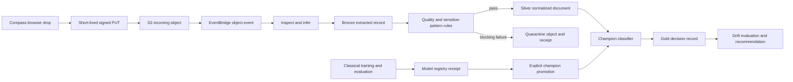

# AWS document intelligence, MLOps, and DevSecOps demo

This implementation covers the meeting's AWS-native requests without claiming
that the synthetic demonstrator is accredited or that an unsubmitted
SageMaker job ran.

## Current evidence state

The implementation in this document is deployed in the `local-fe56c61`
Satsyil stack. The browser can also rehearse it with deterministic replay. The
deployed resource inventory is not, by itself, proof that a document traversed
the live route, Step Functions workflow, Lambda training Adapter, model
promotion, and drift path. Retain the replay label until a new authenticated
end-to-end receipt is captured. No SageMaker training job has been submitted.

## Requirement mapping

| Demo element | What to show | Source evidence |
|---|---|---|
| Element 1, secure access | Team users can review with a password. `presenter@compass.demo` proves per-user TOTP. Every API route remains JWT protected. | `template.yaml`, `scripts/configure_demo_identity_posture.py` |
| Element 2, IaC and DevSecOps | Terraform and SAM definitions, OIDC deployment, SAST, dependency and secret scans, SBOM, policy checks, STIG-aligned evidence, protected apply, and optional DAST. | `infra/terraform`, `.github/workflows`, `security` |
| Element 3, automated ingestion | The browser requests a signed upload and sends TXT, PDF, DOCX, CSV, XLSX, JSON, JSONL, XML, or Markdown directly to private S3. EventBridge starts Step Functions. | `POST /documents/uploads`, `statemachines/document_ml.asl.yaml` |
| Element 4, governance and lineage | Inspect infers shape and fields, hashes the source, counts sensitive patterns, writes bronze, applies quality, then publishes silver and gold or quarantine. | `GET /documents/runs/{run_id}` |
| Element 5, analytics and ML | Train and evaluate the shared six-class classical classifier, inspect the confusion matrix and macro F1, promote a champion, classify a document, and calculate drift. | `/ml/train`, `/ml/models`, `/ml/ops/evidence`, `/ml/drift/evaluate` |

## End-to-end flow



## Browser upload contract

Call `POST /documents/uploads` as the corporate poweruser:

```json
{
  "filename": "technical-report.txt",
  "content_type": "text/plain",
  "size_bytes": 412,
  "synthetic_only": true
}
```

The response contains a 15-minute signed PUT URL and required `Content-Type`
header. The browser uploads bytes directly to S3. It does not proxy document
content through API Gateway or expose AWS credentials. Poll
`GET /documents/runs/{run_id}` to show each real state change and its logical
lineage.

Sample drops are under `seed/documents`. They are deterministic, synthetic,
and deliberately cover unstructured and semi-structured shapes.

The exact contracts can be rehearsed without AWS:

```bash
python3 scripts/run_document_ml_demo.py \
  seed/documents/technical-report.txt \
  seed/documents/grant-abstract.json \
  seed/documents/quarantine-short.txt
```

## Shared model contract

Both platform variants use these labels in this exact order-independent set:

- `grant_abstract`
- `technical_report`
- `publication_summary`
- `patent_summary`
- `investment_brief`
- `financial_execution`

The source baseline has six documents per class. Seed `20260811` hash-orders
each class, one item per class is held out, and the remaining 30 items train a
multinomial Naive Bayes model. The registry receipt includes accuracy, macro
F1, per-class metrics, confusion matrix, training digest, and portable JSON
artifact URI. Confidence below `0.62` marks the classified document for human
review. Champion promotion requires accuracy of at least `0.90` and macro F1
of at least `0.88`.

In `demo` mode, training runs in the Lambda adapter and deployment reports
`online_endpoint: false`. In `sagemaker` mode, submission requires both the
source-controlled execution role and an approved ECR training image. The job
uses one bounded instance, a 30-minute stop condition, network isolation, and
inter-container traffic encryption. Missing configuration returns
`not-submitted` and never invents a job ARN.

## Fast live sequence

1. Log in as `presenter@compass.demo` and complete TOTP.
2. Open the DevSecOps evidence and point to the latest green workflow, SBOM,
   Terraform plan, and STIG-aligned evidence receipt.
3. Drop `seed/documents/technical-report.txt` in the document intake screen.
4. Follow the run from incoming to bronze, quality, silver, classification,
   and gold. Then drop `seed/documents/quarantine-short.txt` to show a blocking
   failure and quarantine.
5. Select Train. Show the deterministic dataset digest, split seed, confusion
   matrix, accuracy, and macro F1.
6. Promote the registered version to `champion`. Point out that this is an
   explicit state change with actor and target, not an implicit latest model.
7. Run drift on the shifted sample. Show population stability,
   out-of-vocabulary rate, the threshold verdict, and `retrain-and-review`.
8. Open the source links for the Step Functions definition, model engine,
   Terraform resources, and policy checks.

## Security evidence boundary

`security/stig/control-mapping.json` is a source-backed evidence index. The
validator proves every referenced implementation token exists. It is not a
DISA checklist result, ATO, IL4 or IL5 accreditation, or assessor attestation.
The controlled DAST workflow accepts only an HTTPS origin with no path,
credentials, private address, or nonstandard port.

Format and content inspection is not an antivirus claim. A production intake
boundary must add an approved malware scanning service and hold documents until
that independent verdict is clean.
