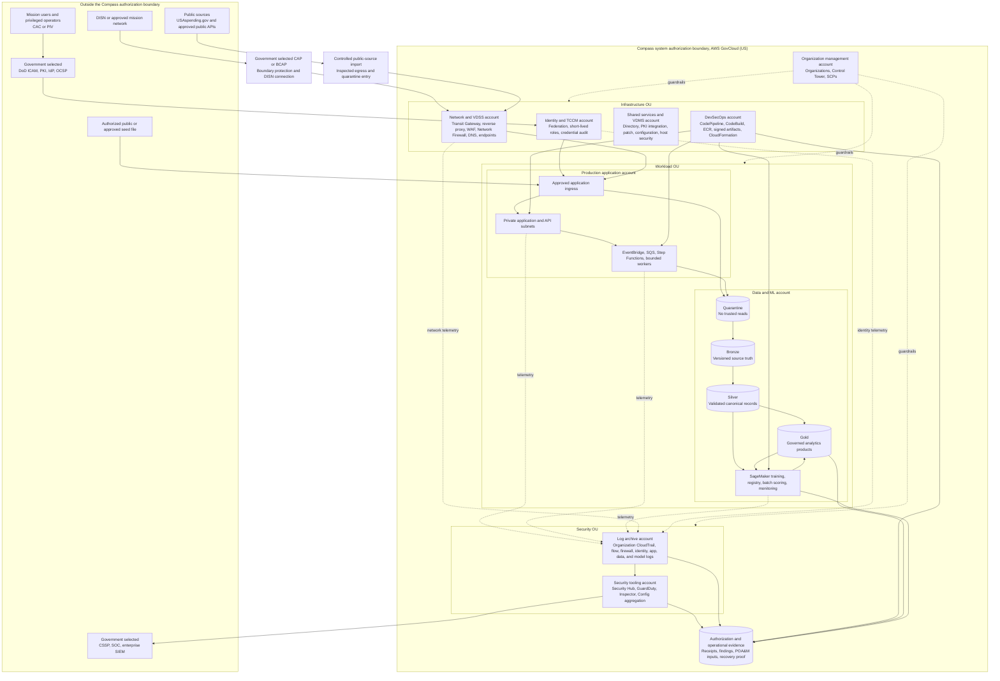

# Compass IL4 and IL5 target architecture

Status: Target reference architecture for planning and demonstration

Research cutoff: 2026-08-12

This document defines how Compass can be migrated from its current public-data
technical demonstrator into an architecture designed to support DoD Impact
Level 4 or Impact Level 5 control implementation. It is not an authorization,
an accreditation, an Authority to Operate, a DISA approval, a FedRAMP
certification, or evidence that the current deployment may process CUI.

## 1. Three states that must remain separate

| State | Meaning | Permitted claim |
|---|---|---|
| Current public-data technical demonstrator | The live Satsyil deployment uses commercial AWS `us-east-1`, CloudFront, synthetic records, and approved public evidence sources. It has technical security controls and production-shaped workflows, but it has no Government authorization boundary. | "Public-data technical demonstrator deployed in commercial AWS." |
| IL4/IL5 target design | The reference design in this document places Compass in AWS GovCloud (US), separates SCCA functions, keeps data and identity inside the intended boundary, and identifies control evidence that the implementation must produce. | "Architecture designed to support IL4/IL5 control implementation, subject to Government validation and authorization." |
| Requires Government environment validation | The mission owner, Authorizing Official, security control assessor, DoD ICAM team, CAP or BCAP owner, CSSP, data owners, contracting authority, and AWS account team must validate the actual information, services, features, connections, controls, and residual risk. | Only the Authorizing Official can approve operation at the selected impact level and within the documented scope. |

The current demonstrator must not ingest, process, store, or transmit CUI. A
future GovCloud deployment must remain non-operational for CUI until the
required Government authorization and connection decisions are complete.

## 2. Impact-level boundary

DoDI 8520.03 describes IL4 as accommodating CUI and other mission-critical
data, including data used in direct support of military or contingency
operations. It describes IL5 as accommodating CUI that requires a higher level
of protection and unclassified national security infrastructure. The
information owner and Authorizing Official determine the applicable level for
the actual system and data.

Cloud authentication is part of this boundary. DoDI 8520.03 states that a
cloud-based authentication action must occur in a cloud service offering
approved at the appropriate impact level. An IL4 resource cannot originate its
authentication in an IL2 cloud.

Therefore, the target does not reuse the current commercial Cognito tenant as
the identity source for protected access. It integrates an approved DoD ICAM
and CAC/PIV path into the intended GovCloud authorization boundary.

## 3. Overall GovCloud, SCCA, account, and trust-boundary design

The diagram is a target topology. Boxes marked "Government selected" are
dependencies that the Compass team cannot authorize or manufacture itself.

### Trust rules

1. No application or data workload receives trust because of network location.
2. No private application, data, or ML subnet has direct internet ingress.
3. Internet retrieval uses a controlled, allowlisted, inspected egress path.
4. Management, user, and data traffic remain logically separated.
5. Human access uses approved federated identity, MFA, least privilege, and
   short-lived sessions.
6. Non-person entities use scoped workload roles and, where required, approved
   certificates or mutually authenticated TLS.
7. AWS service access prefers GovCloud VPC endpoints and FIPS endpoints.
8. Data is encrypted in transit and at rest with approved KMS key policies.
9. Every promotion of data, code, infrastructure, or a model produces an
   attributable, hash-bound receipt.
10. Security and audit logs leave the workload account and enter the Log
    Archive and Security Tooling accounts.
11. Production and non-production use separate accounts and keys.
12. Recovery design spans multiple Availability Zones and, when approved,
    both AWS GovCloud (US) regions.

## 4. SCCA responsibility mapping

| SCCA component | Target Compass implementation | Government dependency or validation |
|---|---|---|
| Cloud Access Point or Boundary Cloud Access Point | Compass routes approved DISN traffic through the organization-provided CAP or BCAP. No workload bypasses the selected boundary. | The DoD organization predetermines the CAP or BCAP and connection process. Compass cannot claim this component from application IaC alone. |
| Virtual Data Center Security Stack | A dedicated Network and VDSS account provides separate traffic paths, centralized routing, reverse proxy capability, WAF, Network Firewall, ingress and egress inspection, flow logging, and alert export. | Validate the organization-specific reverse proxy, TLS inspection, DDoS, packet inspection, ports, protocols and services management, and DMZ extension requirements. |
| Virtual Data Center Managed Services | A Shared Services and VDMS account provides directory integration, approved privileged authentication, patch and configuration management, host security integration, DNS, monitoring, and a separate management network. | Select the approved ACAS and HBSS equivalents, CSSP integration, CAC/PIV services, patch baselines, and STIG profiles. |
| Trusted Cloud Credential Manager | The Identity and TCCM account enforces role issuance, revocation, least privilege, short-lived credentials, privileged activity logging, and alert sharing. | The Authorizing Official appoints the TCCM role and the organization approves the Cloud Credential Management Plan. |

AWS Landing Zone Accelerator can establish much of the multi-account
foundation, but AWS explicitly states that it does not make an environment
compliant by itself. Several SCCA requirements remain partially covered or not
covered and require organization-specific components and assessment.

## 5. CAC/PIV target authentication path

The intended user path is:

1. The user presents a CAC or PIV credential to a DoD-approved identity
   provider and PKI validation service.
2. The identity provider validates certificate status, identity proofing,
   authentication assurance, and required device or session context.
3. The approved provider issues a signed assertion to the selected GovCloud
   federation broker at the required impact level.
4. The broker maps authoritative identity and organization attributes into a
   short-lived application session and, for operators, a short-lived AWS role.
5. Compass evaluates role, organization, resource, purpose, and data-label
   policy for every request.
6. Privilege elevation requires the approved privileged credential and any
   reauthentication required by the organization.
7. Authentication, assertion, authorization, elevation, and sign-out events
   are exported to the central audit plane.

The Government identity team must select the actual ICAM provider, federation
protocol, assurance levels, certificate trust chain, OCSP path, session limits,
attribute contract, account-recovery procedure, and break-glass controls. The
diagram must not label commercial Cognito authentication as the final CAC/PIV
implementation.

## 6. Zero Trust control mapping

| DoD Zero Trust pillar | Target implementation | Demonstrable evidence |
|---|---|---|
| User | CAC/PIV federation, MFA, authoritative user inventory, RBAC plus attributes, least privilege, privileged access management, short sessions, and reauthentication for elevation | Identity assertion metadata, access decision receipt, role session, denied-access event, privilege-elevation event, and periodic access review |
| Device | Government device inventory and posture signals, device certificate validation, endpoint compliance, and no trust from IP location alone | Device assertion, posture decision, non-compliant device denial, certificate status, and endpoint inventory reconciliation |
| Application and Workload | Application inventory, per-workload IAM roles, API authorization, mutually authenticated service paths where required, signed artifacts, dependency controls, SBOM, and continuous scanning | Workload identity, deployment receipt, SBOM, image digest, scan report, signature verification, and approved release gate |
| Data | Data catalog, CUI and dissemination labels, source lineage, KMS encryption, retention, DLP, row and column policy, release approval, and deletion evidence | Object version, source SHA-256, catalog label, key identifier, quality receipt, access decision, export receipt, and retention action |
| Network and Environment | CAP or BCAP, VDSS, macro-segmentation by account and VPC, micro-segmentation by subnet and security policy, private endpoints, inspected egress, and deny-by-default routing | Approved data-flow diagram, route and firewall policy, VPC Flow Logs, WAF events, Network Firewall events, endpoint inventory, and reachability test |
| Automation and Orchestration | Policy-as-code, IaC, drift detection, event-driven quarantine, bounded Step Functions, automated rollback, incident workflows, and controlled remediation | IaC plan, policy result, drift event, state-machine history, remediation receipt, approval gate, and rollback proof |
| Visibility and Analytics | Log network, data, application, identity, and model activity; aggregate findings; correlate actors and run identifiers; send events to the CSSP and SIEM | Organization CloudTrail, Config history, application audit, data-access log, model receipt, Security Hub finding, alarm event, and CSSP delivery proof |

## 7. Controlled USAspending and external-source import

USAspending.gov is a public source outside the Compass authorization boundary.
It must be treated as untrusted input even though its content is public.

### Scheduled pull

1. EventBridge starts a source-specific import plan with an allowlisted URL,
   parameters, maximum response size, request timeout, and cost limit.
2. The fetch worker uses the VDSS inspected egress path. Data and ML subnets do
   not call the public source directly.
3. The response is written first to the quarantine zone. It is not available
   to application search, analytics, training, or model scoring.
4. The source receipt records the canonical URL, query, retrieval timestamp,
   HTTP status, content type, response headers used for provenance, byte count,
   SHA-256, S3 bucket and key, object version, KMS key, importer version, and
   parent schedule event.
5. Validation checks transport completeness, media type, archive safety,
   malware policy, schema, required fields, record limits, duplicate keys,
   semantic rules, and sensitive-pattern policy.
6. A failed check retains the object in quarantine and emits an alert with the
   source receipt and rule result. It cannot promote partial data silently.
7. A passing object is copied into Bronze as immutable source truth, normalized
   into Silver, linked to approved entities, and published into Gold only after
   quality and governance gates pass.
8. A terminal lineage receipt reconciles received, rejected, quarantined,
   canonical, linked, published, and superseded records.
9. Source changes are compared with the previous accepted snapshot. Material
   additions, deletions, funding changes, schema changes, and quality changes
   emit visible product notifications and operational alerts.

### Browser or seed-file upload

An approved user requests a bounded, single-purpose upload capability. The
browser writes the file directly to quarantine storage. The upload receipt
adds the authenticated actor, organization scope, sanitized display name,
declared source, consent or rights basis, media type, size, source SHA-256,
object version, and upload time. From that point forward, the file follows the
same quarantine, Bronze, Silver, Gold, and terminal-reconciliation path as a
scheduled source.

Every stage must carry one immutable `lineage_id`, `source_sha256`,
`source_object_version`, `run_id`, `contract_version`, `actor_or_workload_id`,
`started_at`, and `completed_at`. Derived objects add their own SHA-256 and a
list of parent object versions. No UI-only lineage claim is sufficient.

## 8. ML and explanation boundary

The recommended primary predictive use case remains a public SBIR transition
proxy: estimate whether a public Phase I award is associated with a public
Phase II or III outcome within the declared observation window. It supports
review prioritization, not an ONR mission-success claim.

A complementary unsupervised model can detect unusual funding, timing,
organization, topic, or ingestion changes across any validated structured award
record. It may create a review alert, but it must not make an autonomous
funding, personnel, acquisition, or release decision.

The target MLOps path records:

- approved training snapshot and feature contract
- dataset and source digests
- temporal split and leakage checks
- algorithm, container, dependency, and code versions
- evaluation metrics by relevant cohort
- model artifact digest and registry state
- approver and promotion receipt
- batch or endpoint input and output digests
- prediction evidence class and human-review state
- feature, prediction, quality, and performance drift
- alert, investigation, retraining, rollback, and retirement receipts

An LLM may explain governed model or portfolio results only from approved
retrieved evidence. The answer must cite the supporting record and snapshot,
state uncertainty, and distinguish observed, derived, and predicted claims. It
does not replace the predictive model or human decision maker.

SageMaker and Bedrock eligibility must be checked for the exact GovCloud
region, impact-level column, feature, container, model family, and model version
before inclusion. A service-level authorization does not automatically include
every foundation model.

## 9. Current-to-target delta

| Area | Current public-data demonstrator | IL4/IL5 target | Requires Government validation |
|---|---|---|---|
| AWS partition | Commercial AWS `us-east-1` | Separate AWS GovCloud (US) organization and accounts | GovCloud eligibility, account ownership, billing link, operators, and region selection |
| Information | Synthetic records and approved public evidence only | CUI only after categorization, control implementation, assessment, and authorization | Information types, CUI categories, dissemination controls, privacy, records, and impact level |
| Edge | Commercial CloudFront and WAF | Organization CAP or BCAP plus a GovCloud VDSS ingress path | CAP ownership, public-facing application pattern, reverse proxy, TLS inspection, and DMZ requirements |
| Identity | Commercial Cognito demo identities | DoD ICAM and CAC/PIV federation into an approved impact-level path | IdP, PKI, OCSP, assurance levels, attributes, privileged flow, and exception policy |
| Accounts | Primarily one application stack | Management, Security Tooling, Log Archive, Network, Identity, Shared Services, DevSecOps, environment, and Data/ML accounts | Organization structure, SCPs, delegated administrators, inherited controls, and separation of duties |
| Network | Private data functions with commercial edge and bounded NAT egress | Segmented VPCs, centralized inspection, private endpoints, separate management plane, and deny-by-default egress | Address plan, routes, CAP connection, firewall policy, PPSM, DNS, packet inspection, and monitoring |
| Encryption | KMS and TLS controls in commercial AWS | Approved GovCloud KMS policies, FIPS endpoints, key separation, rotation, recovery, and certificate lifecycle | Cryptographic modules, key custodians, export restrictions, escrow, and destruction policy |
| Data lineage | Hash-bound receipts for synthetic, document, public evidence, and model workflows | Cross-account immutable lineage from source through quarantine, Bronze, Silver, Gold, serving, export, and model outcomes | Data ownership, retention, legal rights, label authority, release rules, and evidentiary retention |
| Continuous source | Reproducible public snapshots are available, but continuous change display is not an IL feed | Controlled scheduled import, change detection, visible freshness, reconciliation, alerts, and failure isolation | Source approval, egress allowlist, refresh rate, records policy, and operational ownership |
| Security operations | CloudWatch alarms, WAF, logs, and deployment evidence | Organization telemetry, Security Hub, GuardDuty, Inspector, Config, central log archive, CSSP and SIEM delivery, and incident automation | CSSP, incident categories, notification timelines, evidence access, retention, and playbooks |
| DevSecOps | GitHub Actions and AWS deployment scripts prove the commercial demo | GovCloud delivery account with isolated artifacts, IaC, signed builds, SBOM, security gates, approval, rollback, and delivery receipts | Approved source system, scanner set, severity policy, waiver authority, supply-chain policy, and promotion roles |
| ML | Governed public SageMaker candidate, batch prediction receipts, model registry state, and review-only result | GovCloud SageMaker MLOps with approved data, model monitoring, drift, alerts, rollback, and human decision controls | Approved use case, training rights, fairness and risk review, metrics, thresholds, approvers, monitoring, and model service scope |
| Availability | Production-shaped demonstration controls | Multi-AZ services, tested restore, regional recovery design, and dependency failure modes | Mission RTO, RPO, continuity tier, alternate region, exercise cadence, and degraded-mode behavior |
| Authorization | No Government authorization package or ATO | Evidence-producing implementation mapped to selected controls | Assessor findings, risk acceptance, POA&M, connection approval, and AO decision |

## 10. Service eligibility verification warning

> Warning: AWS service availability is not the same as inclusion in a DoD
> provisional authorization. A service name in GovCloud is not enough. Verify
> the exact service, feature, endpoint, region, impact-level column, integration,
> data path, and current authorization package before design freeze and again
> before release.

The AWS services-in-scope page states that its table reflects the current
assessment scope and identifies services undergoing assessment or DISA review.
The page showed an update date of 2026-07-10 at this document's research
cutoff. If a service is not listed in the required IL column, its use requires
an explicit mission-owner evaluation and approval. Compass must not silently
add such a service to its protected baseline.

This verification applies separately to:

- AWS services and individual features
- managed AI services and each selected foundation model
- AWS Marketplace products
- Databricks or any other third-party SaaS or PaaS offering
- CI/CD, source-control, observability, notification, email, and support tools
- cross-partition services and integrations
- endpoints that might transmit metadata or content outside GovCloud

Record each decision in a versioned service eligibility register with the
service, feature, region, intended data, IL, source URL, source update date,
verification date, reviewer, restrictions, and approval reference.

## 11. CloudFront boundary warning

> CloudFront is not available inside AWS GovCloud (US). AWS documents that it
> runs in the standard AWS partition and is outside the GovCloud boundary.

The current CloudFront distribution is valid for the public-data technical
demonstrator. It must not be shown inside an IL4 or IL5 authorization boundary
and must not receive CUI. The target protected UI uses the Government-selected
CAP or BCAP and VDSS path with an approved GovCloud-native application ingress.

If an Authorizing Official permits a separate CloudFront distribution for
public-release content, architecture and data-flow diagrams must show it
outside the protected boundary. CUI, protected session data, protected logs,
and export-controlled content must not enter that distribution without an
explicitly approved design and handling determination.

## 12. DevSecOps and continuous evidence target

The delivery path should produce one Delivery Receipt for every revision:

1. immutable source revision and reviewed change
2. dependency lock and SBOM
3. secret, SAST, dependency, license, container, and IaC scans
4. unit, integration, contract, authorization, and negative tests
5. signed artifact and container digests
6. CloudFormation change set and policy-as-code result
7. separation-of-duties approval
8. environment deployment and configuration checks
9. smoke, security-header, authentication, authorization, lineage, alarm, and
   rollback tests
10. deployed resource inventory, service eligibility snapshot, evidence links,
    and final disposition

The approved source-control and CI services must be inside, or integrated with,
the target boundary through a Government-approved transfer pattern. The
commercial GitHub repository and GitHub Actions workflow are demonstration
assets, not assumed IL4/IL5 delivery services.

## 13. Accreditation and authorization evidence checklist

These are required evidence categories, not claims that Compass currently has
them.

- [ ] Government mission owner, system owner, Authorizing Official, security
      control assessor, information owners, ISSO, CSSP, and TCCM roles assigned
- [ ] Mission, users, prohibited uses, information types, CUI categories,
      privacy impact, impact level, and authorization boundary approved
- [ ] Hardware, software, service, API, account, identity, data, model, and
      external dependency inventories completed
- [ ] Current logical, physical, trust-boundary, account, network, identity,
      deployment, and data-flow diagrams approved
- [ ] Control baseline, overlays, organization-defined values, inherited,
      hybrid, and system-specific responsibilities documented
- [ ] System Security Plan and implementation statements completed
- [ ] Cloud Credential Management Plan and privileged-access procedures approved
- [ ] CAP or BCAP and DISN connection process completed as required
- [ ] Ports, protocols, and services register approved
- [ ] Data labeling, retention, records, privacy, release, backup, recovery, and
      destruction procedures approved
- [ ] STIG, ACAS or approved equivalent, HBSS or approved equivalent, code,
      dependency, container, IaC, configuration, and penetration assessments
      completed
- [ ] Security Assessment Plan and Security Assessment Report completed
- [ ] Findings recorded in POA&Ms with owners, milestones, and residual risk
- [ ] Incident response, CSSP integration, alert routing, evidence preservation,
      breach reporting, and tabletop exercise tested
- [ ] Contingency, backup, restore, failover, degraded operation, RTO, and RPO
      tests completed
- [ ] Software supply-chain provenance, SBOM, signing, vulnerability response,
      and emergency rollback demonstrated
- [ ] Data and model lineage, evaluation, human-review, monitoring, drift,
      rollback, and retirement controls assessed
- [ ] Continuous monitoring strategy, evidence cadence, significant-change
      process, and ongoing authorization process approved
- [ ] Authorization package contains the security plan, assessment report, all
      POA&Ms, and the authorization decision document
- [ ] Authorizing Official issues the applicable authorization decision and all
      operating conditions are enforced

## 14. Primary official sources

- [DoDI 8520.03, Identity Authentication for Information Systems](https://www.esd.whs.mil/Portals/54/Documents/DD/issuances/dodi/852003p.pdf)
- [DoDI 8510.01, Risk Management Framework for DoD Systems](https://www.esd.whs.mil/Portals/54/Documents/DD/issuances/dodi/851001p.pdf)
- [DoD Zero Trust Strategy](https://dodcio.defense.gov/Portals/0/Documents/Library/DoD-ZTStrategy.pdf)
- [DoD Zero Trust Capability Execution Roadmap](https://dodcio.defense.gov/Portals/0/Documents/Library/ZT-ExecutionRoadmap-v1.1.pdf)
- [DoD Cloud Computing Security Requirements Guide document portal](https://public.cyber.mil/dccs/dccs-documents/)
- [Current authorized DoD cloud service offerings](https://public.cyber.mil/dccs/cso/)
- [AWS DoD Cloud Service Provider SRG overview](https://aws.amazon.com/compliance/dod/)
- [AWS services in scope for the DoD Cloud Service Provider SRG](https://aws.amazon.com/compliance/services-in-scope/DoD/)
- [What is AWS GovCloud (US)](https://docs.aws.amazon.com/govcloud-us/latest/UserGuide/whatis.html)
- [AWS GovCloud (US) compared with standard AWS regions](https://docs.aws.amazon.com/govcloud-us/latest/UserGuide/govcloud-differences.html)
- [AWS GovCloud (US) service catalog and differences](https://docs.aws.amazon.com/govcloud-us/latest/UserGuide/using-services.html)
- [SCCA components and requirements on AWS](https://docs.aws.amazon.com/prescriptive-guidance/latest/secure-architecture-dod/scca-components-and-requirements.html)
- [Virtual Data Center Security Stack guidance](https://docs.aws.amazon.com/prescriptive-guidance/latest/secure-architecture-dod/virtual-data-center-security-stack.html)
- [Virtual Data Center Managed Services guidance](https://docs.aws.amazon.com/prescriptive-guidance/latest/secure-architecture-dod/vdms.html)
- [Trusted Cloud Credential Manager guidance](https://docs.aws.amazon.com/prescriptive-guidance/latest/secure-architecture-dod/tccm.html)
- [Landing Zone Accelerator on AWS](https://docs.aws.amazon.com/solutions/latest/landing-zone-accelerator-on-aws/)
- [CloudFront with AWS GovCloud resources](https://docs.aws.amazon.com/govcloud-us/latest/UserGuide/setting-up-cloudfront.html)
- [Amazon Bedrock model authorization status](https://aws.amazon.com/compliance/services-in-scope/FedRAMP/amazon-bedrock-models/)
- [FedRAMP authorization designation outcome and agency ATO distinction](https://www.fedramp.gov/notices/0004/)

## 15. Approved presentation language

Use:

> Compass currently runs as a public-data technical demonstrator in commercial
> AWS. This separate target architecture shows how the same portable contracts,
> lineage, controls, and IaC can be deployed into AWS GovCloud to support an IL4
> or IL5 authorization effort. The Government mission owner still selects the
> impact level, identity, CAP or BCAP, inherited controls, assessment path, and
> operational authorization.

Do not use:

- "Compass is IL4 compliant."
- "Compass is IL5 accredited."
- "AWS GovCloud automatically gives Compass an ATO."
- "FedRAMP authorization authorizes this application."
- "The current CloudFront deployment is inside GovCloud."
- "The architecture diagram proves compliance."
