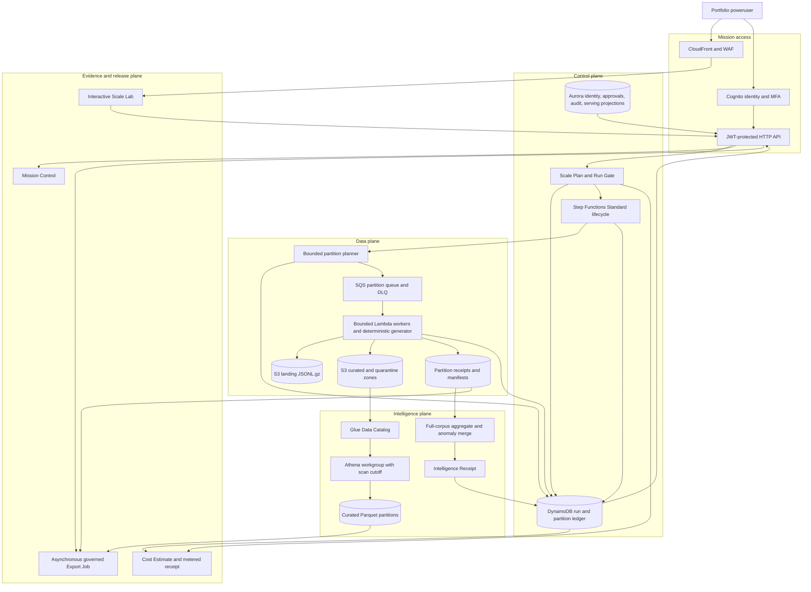

# Compass production-scale architecture

Status: deployed in Satsyil AWS in HA mode and live-verified on 2026-08-11.

This diagram is the architecture deployed by the production-scale
demonstrator. Solid arrows are runtime data or control flow. Receipts are
sanitized before they reach the browser.

## Deployed shape

| Boundary | Live Satsyil evidence |
|---|---|
| Interface | 25 Cognito-protected API operations across 23 URL paths |
| Compute | 17 Lambda functions, bounded worker concurrency, one active Scale Run, and Standard Step Functions orchestration |
| Data | Private encrypted Aurora with one writer and one reader, 14-day backups, deletion protection, DynamoDB ledger, SQS with DLQ, and governed S3 lake zones |
| Intelligence | Six Glue tables, scan-limited Athena, Parquet materialization, full-corpus deterministic topic and anomaly aggregation, and governed export |
| Edge and identity | CloudFront, WAF, exact-origin CORS, Cognito password plus TOTP, and ready poweruser, reviewer, and viewer personas |
| Operations | 11 alarms, 2 dashboards, API and workflow logs, application logs, and X-Ray tracing |

The fixed demonstration baseline passed 19 of 19 preparation checks. A live
browser session completed real Cognito password and TOTP authentication,
loaded all nine product screens without `Failed to fetch`, and exercised the
Scale controls. CORS verification passed all 25 protected operations. Live
responses included CSP, Permissions Policy, HSTS, and WAF protection.

## Measured bounded Scale Runs

| Profile | Records | Partitions | Duration | Quality | Curated | Quarantined | Anomalies | Export rows |
|---|---:|---:|---:|---:|---:|---:|---:|---:|
| 1K | 1,000 | 6 | 21.351 s | 98.90 | 989 | 11 | 143 | 989 |
| 10K | 10,000 | 6 | 20.329 s | 98.91 | 9,891 | 109 | 1,403 | 9,891 |
| 100K | 100,000 | 11 | 25.853 s | 98.92 | 98,921 | 1,079 | 13,727 | 98,921 |
| 1M | 1,000,000 | 41 | 72.615 s | 98.98 | 989,852 | 10,148 | 137,852 | 989,852 |

The 1M Intelligence Receipt covered all 200,000 generated grant records. Each
run reconciled generated records to curated plus quarantined records and
produced a ready governed Parquet export.

The saved acceptance receipts invoked the deployed Scale Control Lambda using
AWS IAM and a staged API Gateway event. That path exercised the same route
handler and live data plane, but bypassed Cognito, API Gateway transport, WAF,
and the browser. Those interfaces were verified separately through the live
browser and 25-operation CORS checks.

## Evaluator flow

| Step | What happens | Proof shown in Scale Lab |
|---:|---|---|
| 1 | The server creates a Scale Plan from a fixed profile. | Price source, quantities, Cost Envelope, limits, and launch decision. |
| 2 | The Run Gate consumes the plan once and starts a durable run. | Plan ID, run ID, idempotency key, revision, and synthetic-only disclosure. |
| 3 | The workflow plans bounded partitions and SQS absorbs the burst. | Target records, exact partition count, queue depth, retries, DLQ, and partition grid. |
| 4 | Workers generate deterministic records and stream landing objects. | Generated records, raw bytes, part checksums, seed, and contract version. |
| 5 | Workers validate, curate, quarantine, and emit aggregate partials. | Exact record disposition, quality rule totals, bytes, and Partition Receipts. |
| 6 | Athena creates compressed Parquet through a scan-limited workgroup. | Query state, bytes scanned, Parquet bytes, and output checksum set. |
| 7 | Finalization merges every receipt. | Full-corpus topics, anomalies, quality invariant, throughput, and terminal manifest. |
| 8 | An Export Job releases immutable lake objects under policy. | Format, rows, bytes, checksum, expiry, and audit receipt. |
| 9 | Mission Control projects sanitized evidence. | Latest Scale Run, health, cost state, and deployment revision. |

## Capacity model

- Every partition has at most 25,000 records. The 1K, 10K, and 100K evaluator profiles use smaller defaults.
- Worker reserved concurrency defaults to 4 and is configurable only at deployment.
- One Scale Run is active by default.
- The 10k and 100k profiles are normal evaluator profiles.
- The 1m profile requires a successful 100k receipt and an explicit deployment limit of 1,000,000 records.
- The live Satsyil evidence completed the 100k proof gate and then the 1m run. The browser showed the 1m profile unlocked and its exact cost gate enabled.
- Scale objects expire after seven days. Evidence manifests use a longer bounded retention.
- Athena refuses any single query that would scan more than 10 GB.
- Semantic enrichment is capped independently from full-corpus deterministic intelligence.
- This is production-shaped, bounded synthetic evidence. It is not an ATO,
  Exhibit B certification, unlimited-load result, sustained-concurrency test,
  multi-terabyte validation, or evidence from Government data.
